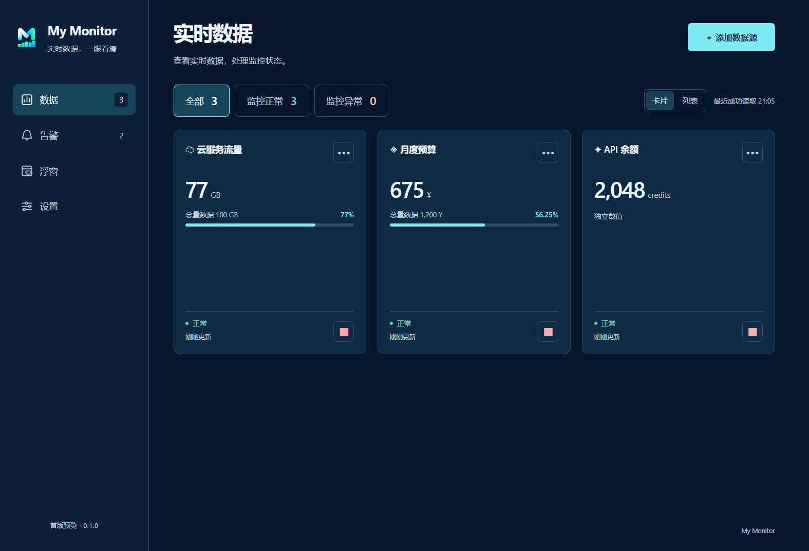
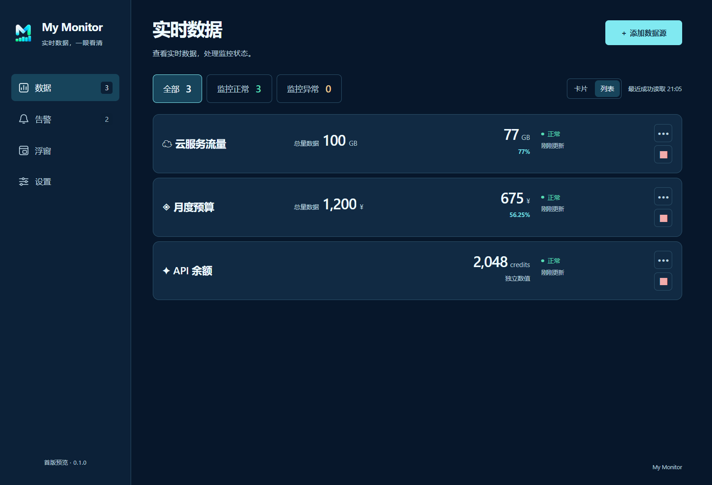
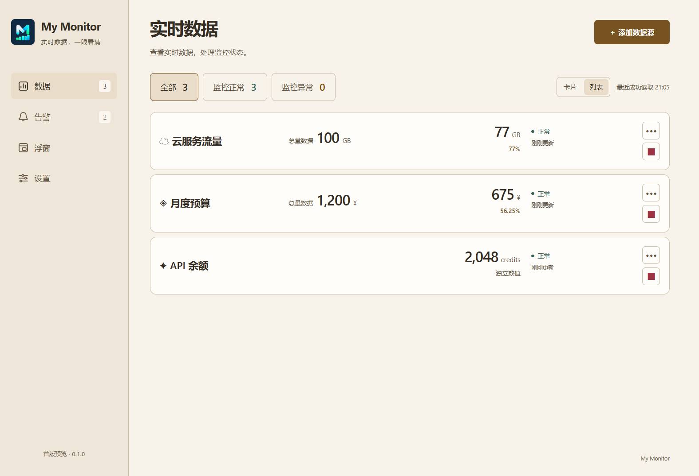
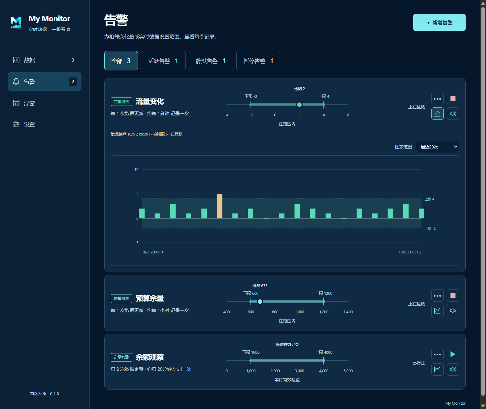
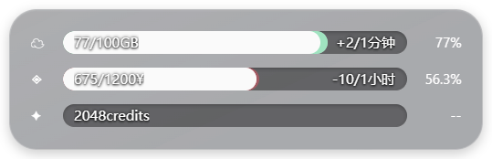
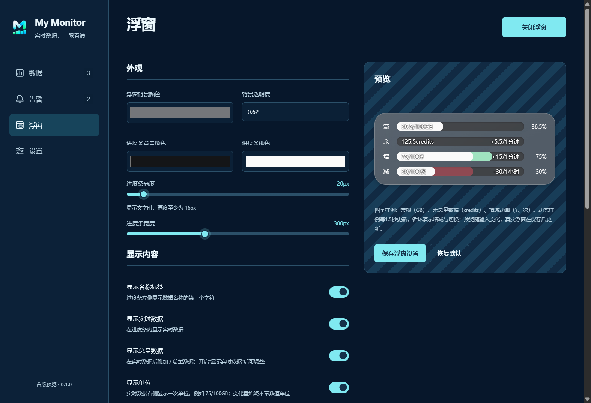
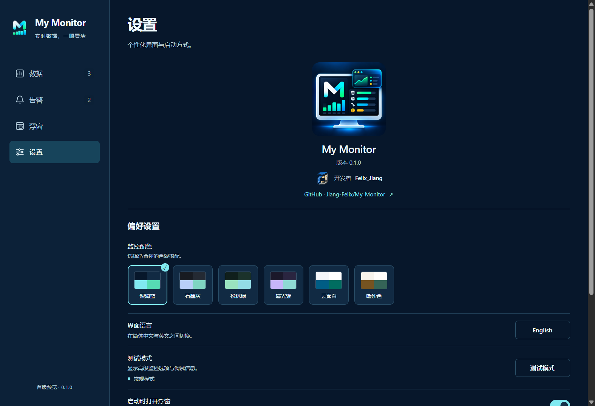

<div align="center">
  
  <h1>My Monitor</h1>
  <p><strong>把网页里的数值，带到你的桌面。</strong></p>
  <p>实时数据 · 范围告警 · 半透明浮窗 · 本地保存</p>
  <p>
    
    
    
  </p>
  <p>
    <a href="https://github.com/Jiang-Felix/My_Monitor/releases">下载 / Releases</a> ·
    <a href="docs/USER_GUIDE.md">使用说明</a> ·
    <a href="CHANGELOG.md">更新记录</a> ·
    <a href="https://github.com/Jiang-Felix/My_Monitor/issues">反馈 / Issues</a>
  </p>
  <p><sub>A local desktop monitor for web metrics, range alerts and a floating progress overlay.</sub></p>
</div>

My Monitor 将云服务流量、余额、预算等分散的数值放到同一个监控台。你可以在网页中直接选取实时数据和总量数据，用浮窗查看进度，再为实时数据或相邻记录的变化量设置告警。

软件无需 My Monitor 账户，配置和记录保存在本机。采集会访问你设置的网站；网站本身仍可能使用网络服务。当前为 **Windows x64 首个公开预览版**，其他平台尚未验证。

> 此 README 已为首次发布准备好；Release 链接在维护者发布 `v0.1.0` 后才会提供可下载附件。文中截图来自当前软件，使用模拟数据及演示时间，不包含真实账户或凭证。

## 一眼看清实时数据



| 页面 | 能做什么 |
| --- | --- |
| **数据** | 网页选取或固定数值；卡片 / 列表切换；全部、监控正常、监控异常筛选；编辑、暂停与恢复监控 |
| **告警** | 变量检测 / 定量检测；范围数轴；直方图 / 折线图；独立记录倍率；通知开关与分类统计 |
| **浮窗** | 置顶、无边框、半透明圆角面板；进度、最近变化量可视化、瞬时变化量数值与平滑动画 |
| **设置** | 六种配色、简体中文 / English、启动时打开浮窗、开机自启、托盘交互及测试模式 |

<details>
<summary>展开查看列表模式与浅色配色</summary>




</details>

## 看见变化，再决定是否提醒



- **变量检测**：比较本次与上次记录的差值，保留正负方向，用直方图显示变化。
- **定量检测**：检查本次实时数据，用折线图显示记录值。
- 上下限包含边界；每个越界记录都会产生告警事件。可关闭系统通知，保留相同的记录和图表。
- 图表可选择最近 **10 / 20 / 50** 次记录；数轴同时容纳设置的边界和最近 5 次检测值。
- 停止后保留记录供查看；每次开始时清空并重新记录。运行中采集中断或程序重启会开始新的一段。

## 桌面上的一小块进度

<div align="center">
  
</div>

灰色半透明面板、深色半透明轨道和白色圆角进度条构成磨砂风格浮窗。绿色 / 红色可视化最近一次非零变化，瞬时变化量文字显示本次更新差值；两者独立设置。

默认进度条为 **20 × 300 px**，默认开启各项显示和平滑移动，仅“显示零变化”关闭。支持颜色、透明度、尺寸、文字对齐、单位和总量数据开关；保存最后位置，重启后恢复。



> 浮窗使用真实的窗口透明度；“磨砂”是视觉风格，并非对其他应用窗口进行系统级背景模糊。实际透明效果取决于桌面合成环境。

## 按自己的习惯使用

配色方块可在六种深浅主题之间切换。语言、启动浮窗和托盘手势会保存；测试模式每次启动默认关闭，用于显示高级来源配置与调试信息。

<details>
<summary>展开查看主题与偏好设置</summary>



</details>

## 下载与第一次使用

1. 在 [Releases](https://github.com/Jiang-Felix/My_Monitor/releases) 下载 `MyMonitor-v0.1.0-windows-x64.zip`，**完整解压**到一个固定目录。
2. 运行解压目录内的 `MyMonitor.exe`。不要只移动 exe，它需要同目录的 Electron 运行文件。
3. 在“数据”中添加数据源，填入名称、单位和网址；打开网页选取窗口，完成登录后选取数值。
4. 设置总量数据（可选）和更新频率，先“测试读取”，确认后保存。
5. 根据需要创建告警，在“浮窗”和“设置”中调整显示与启动方式。

此版本为文件夹分发，**没有安装器、代码签名或自动更新**。可以使用 Release 中的 `SHA256SUMS.txt` 校验下载文件；安全软件提示时先核对来源及校验值，不建议关闭系统防护。

详细步骤、示例和排错见 [使用说明](docs/USER_GUIDE.md)。

## 使用前了解这些行为

- **1 秒读取不等于网站 1 秒更新。** 常规模式的 `1s` / `30s` 使用“网页自主更新”，读取已打开页面的数值，不主动重载。网页必须自行更新内容；其他档位按周期重新加载网页。
- 第三方网站可能限制嵌入式登录或自动访问。登录过期、页面改版、验证码和限流均可能需要人工处理；不保证所有 Google 登录流程可用。
- 实时数据大于总量数据、选取内容无法解析、采集失败、暂停或数据过期会归入“监控异常”。旧有效数值会注明旧值，避免误当成最新数据。
- 通知依赖 Windows 通知设置。连续越界仍会记录，但密集通知会合并为约每 2 秒一次的系统摘要，避免通知风暴。
- 软件关闭时无法持续监控。关闭主窗口会留在托盘；真正退出请使用托盘菜单“退出”。
- 删除数据源会同时删除关联告警及其记录；删除前会提示。当前不提供长期历史记录数据库或数据导出。

## 本地数据与安全

默认数据目录：`%APPDATA%\my-monitor\`。配置文件为 `monitor-state.json`；网页登录状态位于该目录内的独立浏览器分区。

API Token 和识别到含凭证参数的网址使用 Windows 系统加密；网页登录资料仍是敏感本地文件。同一 Windows 用户权限下的其他程序可能访问这些资料。**不要上传、公开或随 Issue 附上数据目录、Cookie、Token 或包含凭证的网址。**

应用设置了采集并发、请求频率、响应体积、网页流量、窗口数量和运行资源保护，并对失败请求退避重试。这些保护用于减少资源异常，不构成对所有网页、驱动或操作系统环境的无故障保证。详见 [安全说明](SECURITY.md) 与 [使用注意事项](docs/USER_GUIDE.md#本地数据与备份)。

## 从源码运行

需要 Windows x64、Node.js **24 或更高版本**、npm 和 Git。

```powershell
git clone https://github.com/Jiang-Felix/My_Monitor.git
cd My_Monitor
npm ci
npm start
```

```powershell
npm run check
npm test
npm run smoke
npm run package
```

打包默认输出 `release/0.1.0/MyMonitor-win32-x64/`。开发结构、隔离测试和打包校验见 [开发说明](docs/DEVELOPMENT.md)；版本规则和首次上传流程见 [发布指南](docs/RELEASING.md)。

## 参与与反馈

使用问题或缺陷请通过 [Issues](https://github.com/Jiang-Felix/My_Monitor/issues) 提交；新功能可以使用功能建议模板。贡献前请阅读 [CONTRIBUTING](CONTRIBUTING.md)。涉及凭证泄露或其他安全漏洞时，按 [SECURITY](SECURITY.md) 私下报告。

<div align="center">
  
  <p>Designed &amp; developed by <strong>Felix_Jiang</strong></p>
  <p><a href="LICENSE">MIT License</a> · Electron / Chromium 等第三方组件遵循各自许可证。</p>
</div>
